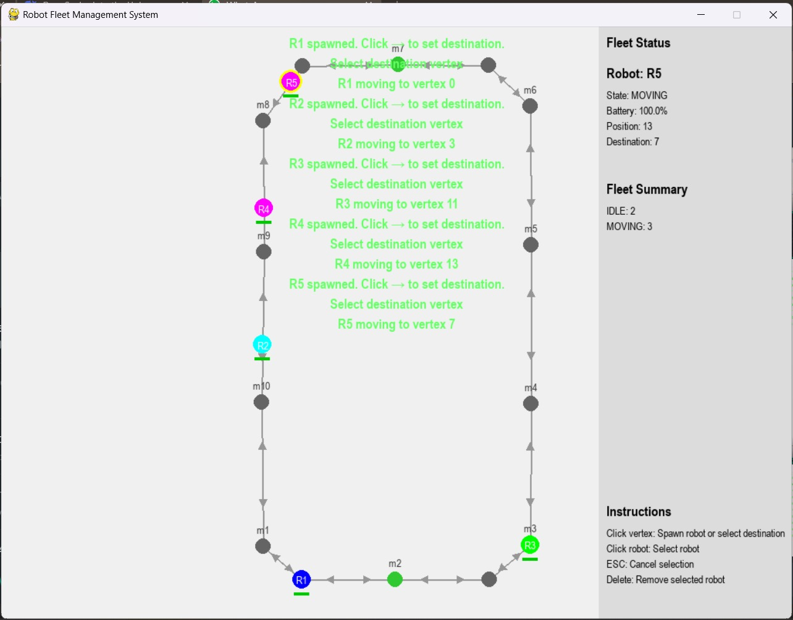
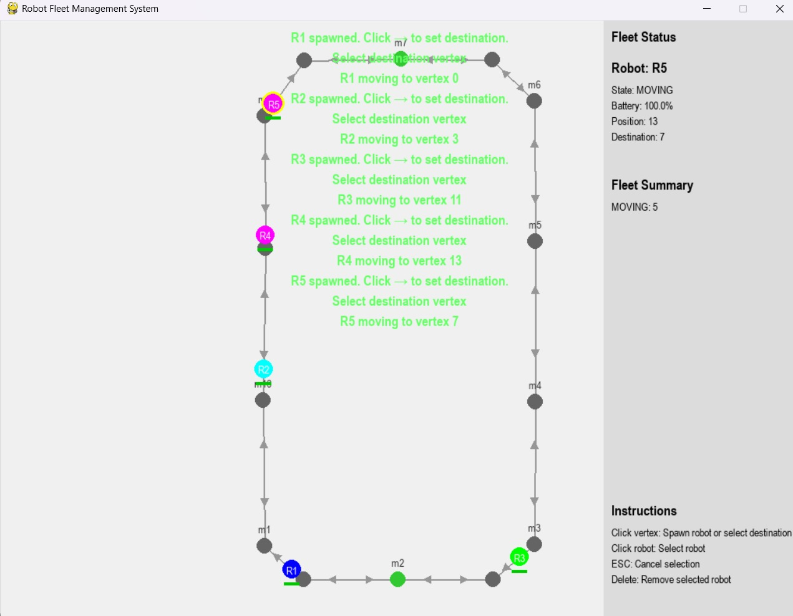
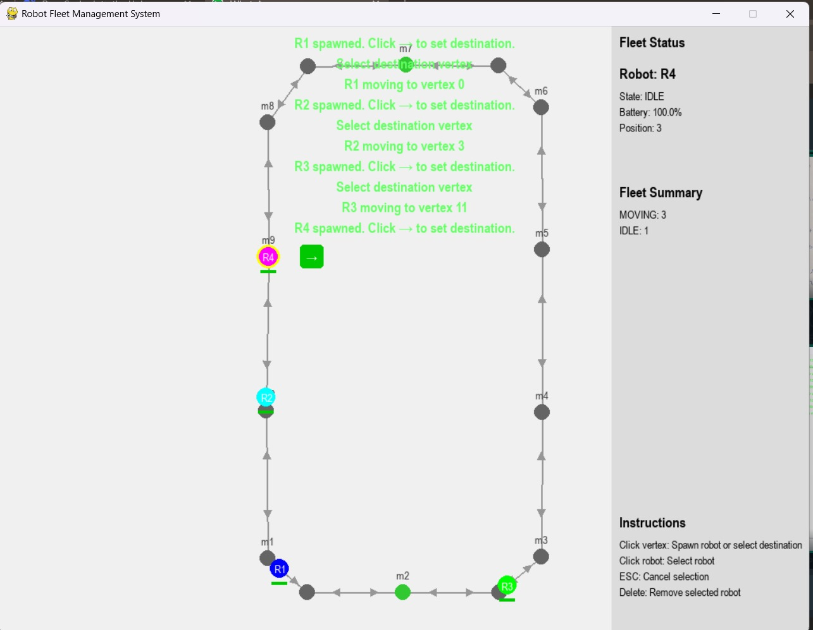
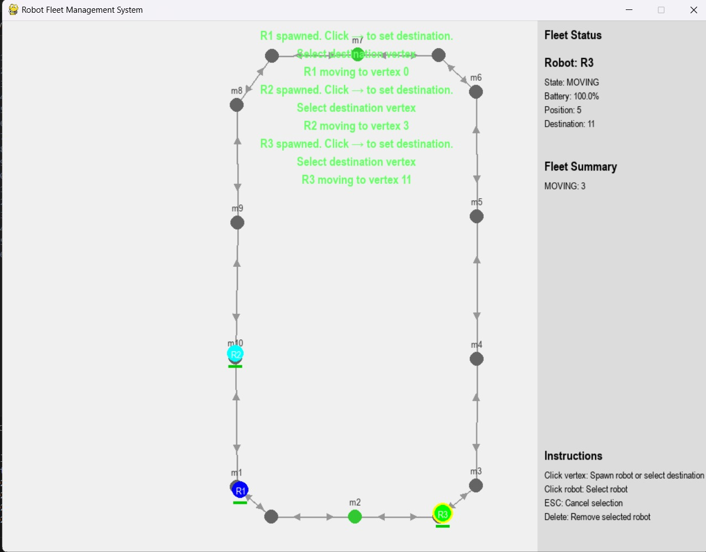

22PC13 - Hamanth M

Robot FLeet Management System:

Features:

  Spawning a robot on valid vertice
  Assigning destination for spawned robots
  Moving along the destinations in shortest path
  Avoiding collisions among moving robots

Terminal command to run the GUI: PS C:\Users\nisha\Documents\Goat_Robotics_22PC13> python -m src.main

Demo video:

Uploaded Screen shots:
## Uploaded Screenshots:

### Screenshot 1:

### Screenshot 2:

### Screenshot 3:

### Screenshot 4:

